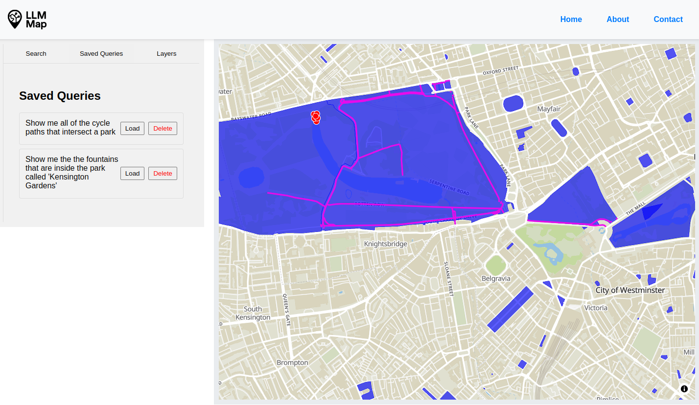

# LLM Map


**LLM Map** is an experimental project exploring different ways users can interact with a web map using Large Language Models (LLMs). The goal is to combine spatial data with natural language interfaces to create intuitive, map-based experiences.

Contributions are welcome — whether you're refining the UX, improving prompts, or adding new capabilities!



---

To run the project locally:

1. **Clone the repository:**

   ```bash
   git clone https://github.com/your-username/llm-map.git
   cd llm-map
   ```

2. **Get an API key from MapTiler:**

   Sign up at [MapTiler](https://docs.maptiler.com/cloud/api/authentication-key/#api-key) and create an API key. You’ll need this to load the base map tiles.

   - With your new api key, make a copy of the `.env.example` and name it `.env`
   - Update the `MAPTILER_API_KEY` value

3. **Start the project using Docker:**

   ```bash
   docker-compose build
   docker-compose up
   ```

4. **Seed the Database**

   The database should auatomatically seed and give you 4 new tables within the `layers` schema: `cycle_paths`, `drinking_water`, `fountains`, `parks`.

Once it’s up and running, open your browser to `http://localhost:9001` (or whichever port is specified) and start exploring!

---
